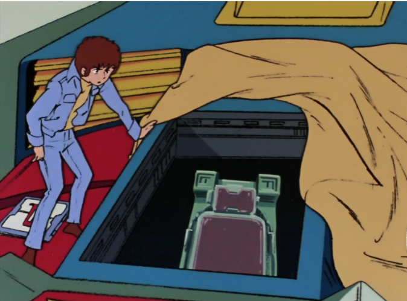

## Description

Side 7 is being attacked by Zeon's MS.

Amuro want to rise Gundam, but he need a core float.

## Difficulty

:star:

## flag

flag{GuNd4m_D4i3hl_Ni_Tatsu!!}

## Platform

Linux-x64

## Hint

1. How to save a float?
2. How can we send a unprintable char to remote?

## WriteUp

