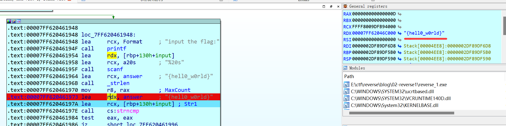

## 0x00 - Test
直接运行程序，程序提示`input the flag:`

## 0x01 - Disassemble
使用`IDA Pro`打开程序，在`0x1400118C0`找到`main`按下`F5`反汇编得到：
```cpp
int __cdecl main(int argc, const char **argv, const char **envp)
{
  char *v3; // rdi
  __int64 i; // rcx
  size_t v5; // rax
  size_t v6; // rax
  char v8[36]; // [rsp+0h] [rbp-20h] BYREF
  int j; // [rsp+24h] [rbp+4h]
  char Str1[224]; // [rsp+48h] [rbp+28h] BYREF
  unsigned __int64 v11; // [rsp+128h] [rbp+108h]

  v3 = v8;
  for ( i = 82i64; i; --i )
  {
    *(_DWORD *)v3 = -858993460;
    v3 += 4;
  }
  for ( j = 0; ; ++j )
  {
    v11 = j;
    v5 = j_strlen(Str2);
    if ( v11 > v5 )
      break;
    if ( Str2[j] == 111 )
      Str2[j] = 48;
  }
  sub_1400111D1("input the flag:");
  sub_14001128F("%20s", Str1);
  v6 = j_strlen(Str2);
  if ( !strncmp(Str1, Str2, v6) )
    sub_1400111D1("this is the right flag!\n");
  else
    sub_1400111D1("wrong flag\n");
  sub_14001113B(v8, &unk_140019D00);
  return 0;
}
```
显然`sub_1400111D1`是`printf`，而`sub_14001128F`是`scanf`，在使用`N`键重命名后主要逻辑如下：
```cpp
for ( i = 0; ; ++i )
{
  ii = i;
  anslen = strlen(answer);
  if ( ii > anslen )
    break;
  if ( answer[i] == 'o' )
    answer[i] = '0';
}
printf("input the flag:");
scanf("%20s", input);
if ( !strncmp(input, answer, strlen(answer)) )
  printf("this is the right flag!\n");
else
  printf("wrong flag\n");
```

## 0x02 - Analyse
### Static
分析程序发现，用于验证的字符串中的'o'全部被替换成了'0'，而字符串原本为`{hello_world}`，经替换后即为`{hell0_w0rld}`，输入到程序中发现即为正确答案。
### Dynamic
在`0x140011973`处下断点，运行程序随便输入一个字符串后发现在`lea     rdx, answer`之后`rdx`指向的地址中的内容为`{hell0_w0rld}`，故得到`flag`


## 0x03 - Flag
故`flag{hell0_w0rld}`
