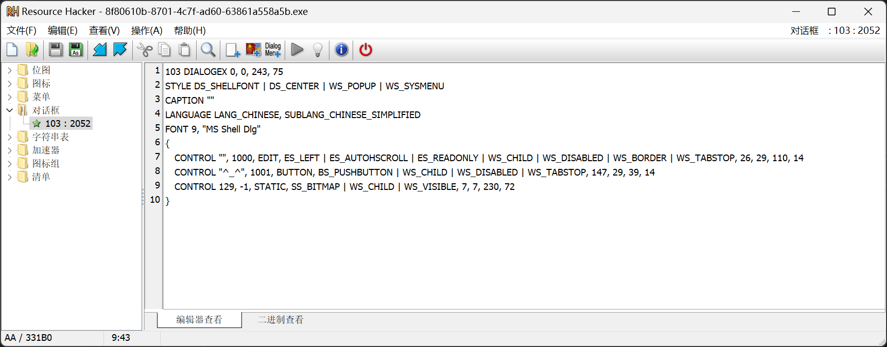

## 0x00 - Test
打开程序发现有一个刮开有奖，但看不到有其它控件的存在，使用`Resource Hacker`查看资源。

## 0x01 - Glance At the Resource

直接把STATIC控件隐藏并启用按钮：
```
103 DIALOGEX 0, 0, 243, 75
STYLE DS_SHELLFONT | DS_CENTER | WS_POPUP | WS_SYSMENU
CAPTION ""
LANGUAGE LANG_CHINESE, SUBLANG_CHINESE_SIMPLIFIED
FONT 9, "MS Shell Dlg"
{
   CONTROL "", 1000, EDIT, ES_LEFT | ES_AUTOHSCROLL | ES_READONLY | WS_CHILD | WS_VISIBLE | WS_BORDER | WS_TABSTOP, 26, 29, 110, 14 
   CONTROL "^_^", 1001, BUTTON, BS_PUSHBUTTON | WS_CHILD | WS_VISIBLE | WS_TABSTOP, 147, 29, 39, 14 
   CONTROL 129, -1, STATIC, SS_BITMAP | WS_CHILD, 7, 7, 230, 72 
}
```
再保存文件并运行即可。

## 0x02 - Disassemble
```cpp
INT_PTR __stdcall DialogFunc(HWND hDlg, UINT a2, WPARAM a3, LPARAM a4)
{
  char *v4; // esi
  char *v5; // edi
  int v7[11]; // [esp+8h] [ebp-20030h] BYREF
  char input[65536]; // [esp+34h] [ebp-20004h] BYREF
  char v9[65535]; // [esp+10034h] [ebp-10004h] BYREF

  if ( a2 == 272 )
    return 1;
  if ( a2 != 273 )
    return 0;
  if ( (_WORD)a3 == 1001 )
  {
    memset(input, 0, 0xFFFFu);
    GetDlgItemTextA(hDlg, 1000, input, 0xFFFF);
    if ( strlen(input) == 8 )
    {
      v7[0] = 'Z';
      v7[1] = 'J';
      v7[2] = 'S';
      v7[3] = 'E';
      v7[4] = 'C';
      v7[5] = 'a';
      v7[6] = 'N';
      v7[7] = 'H';
      v7[8] = '3';
      v7[9] = 'n';
      v7[10] = 'g';
      sub_4010F0(v7, 0, 10);
      memset(v9, 0, sizeof(v9));
      v9[0] = input[5];
      v9[2] = input[7];
      v9[1] = input[6];
      v4 = sub_401000(v9, strlen(v9));
      memset(v9, 0, sizeof(v9));
      v9[1] = input[3];
      v9[0] = input[2];
      v9[2] = input[4];
      v5 = sub_401000(v9, strlen(v9));
      if ( input[0] == v7[0] + 34
        && input[1] == v7[4]
        && 4 * input[2] - 141 == 3 * v7[2]
        && input[3] / 4 == 2 * (v7[7] / 9)
        && !strcmp(v4, "ak1w")
        && !strcmp(v5, "V1Ax") )
      {
        MessageBoxA(hDlg, "U g3t 1T!", "@_@", 0);
      }
    }
    return 0;
  }
  if ( (_WORD)a3 != 1 && (_WORD)a3 != 2 )
    return 0;
  EndDialog(hDlg, (unsigned __int16)a3);
  return 1;
}
```

## 0x03 - Analyse
经分析，`sub_401000`即为`base64_encode`，`sub_4010F0`即为`sort`，
故得到解题脚本如下：
```python
import base64

table = sorted([90, 74, 83, 69, 67, 97, 78, 72, 51, 110, 103])

print(bytes(chr(table[0] + 34) + chr(table[4]), 'utf-8') + base64.decodebytes(b'V1Ax') + base64.decodebytes(b'ak1w'))
```

## 0x04 - Bruteforce
若难以分析程序逻辑，考虑到只有8位字符，可以暴力枚举(127 - 32) ^ 8种全部可能性，逐一验证即可。
```cpp
#include <cstdio>
#include <cstring>
#include <cstdlib>

void __cdecl sub_4010F0(int* arr, int start, int end)
{
    int _end; // eax
    int i; // esi
    int _i; // ecx
    int val; // edx

    _end = end;
    for (i = start; i <= end; start = i)
    {
        _i = i;
        val = arr[i];
        if (start < _end && i < _end)
        {
            do
            {
                if (val > arr[_end])
                {
                    if (i >= _end)
                        break;
                    ++i;
                    arr[_i] = arr[_end];
                    if (i >= _end)
                        break;
                    while (arr[i] <= val)
                    {
                        if (++i >= _end)
                            goto LABEL_13;
                    }
                    if (i >= _end)
                        break;
                    _i = i;
                    arr[_end] = arr[i];
                }
                --_end;
            } while (i < _end);
        }
    LABEL_13:
        arr[_end] = val;
        sub_4010F0(arr, start, i - 1);
        _end = end;
        ++i;
    }
}

char* __cdecl sub_401000(char* a1, int a2)
{
    int v2; // eax
    int v3; // esi
    size_t v4; // ebx
    char* v5; // eax
    char* v6; // edi
    int v7; // eax
    char* v8; // ebx
    int v9; // edi
    int v10; // edx
    int v11; // edi
    int v12; // eax
    int i; // esi
    char* result; // eax
    char* v15; // [esp+Ch] [ebp-10h]
    char* v16; // [esp+10h] [ebp-Ch]
    int v17; // [esp+14h] [ebp-8h]
    int v18; // [esp+18h] [ebp-4h]

    v2 = a2 / 3;
    v3 = 0;
    if (a2 % 3 > 0)
        ++v2;
    v4 = 4 * v2 + 1;
    v5 = (char*)malloc(v4);
    v6 = v5;
    v15 = v5;
    if (!v5)
        exit(0);
    memset(v5, 0, v4);
    v7 = a2;
    v8 = v6;
    v16 = v6;
    if (a2 > 0)
    {
        while (1)
        {
            v9 = 0;
            v10 = 0;
            v18 = 0;
            do
            {
                if (v3 >= v7)
                    break;
                ++v10;
                v9 = (unsigned __int8)a1[v3++] | (v9 << 8);
            } while (v10 < 3);
            v11 = v9 << (8 * (3 - v10));
            v12 = 0;
            v17 = v3;
            for (i = 18; i > -6; i -= 6)
            {
                if (v10 >= v12)
                {
                    *((unsigned char*)&v18 + v12) = (v11 >> i) & 0x3F;
                    v8 = v16;
                }
                else
                {
                    *((unsigned char*)&v18 + v12) = 64;
                }
                *v8++ = "ABCDEFGHIJKLMNOPQRSTUVWXYZabcdefghijklmnopqrstuvwxyz0123456789+/="[*((char*)&v18 + v12++)];
                v16 = v8;
            }
            v3 = v17;
            if (v17 >= a2)
                break;
            v7 = a2;
        }
        v6 = v15;
    }
    result = v6;
    *v8 = 0;
    return result;
}

bool test(char input[])
{
    int v7[11];
    char v9[1000];

    v7[0] = 90;
    v7[1] = 74;
    v7[2] = 83;
    v7[3] = 69;
    v7[4] = 67;
    v7[5] = 97;
    v7[6] = 78;
    v7[7] = 72;
    v7[8] = 51;
    v7[9] = 110;
    v7[10] = 103;
    sub_4010F0(v7, 0, 10);
    memset(v9, 0, sizeof(v9));
    v9[0] = input[5];
    v9[2] = input[7];
    v9[1] = input[6];
    char* v4 = sub_401000(v9, strlen(v9));
    memset(v9, 0, sizeof(v9));
    v9[1] = input[3];
    v9[0] = input[2];
    v9[2] = input[4];
    char* v5 = sub_401000(v9, strlen(v9));
    if (input[0] == v7[0] + 34
        && input[1] == v7[4]
        && 4 * input[2] - 141 == 3 * v7[2]
        && input[3] / 4 == 2 * (v7[7] / 9)
        && !strcmp(v4, "ak1w")
        && !strcmp(v5, "V1Ax"))
    {
        free(v4);
        free(v5);
        return true;
    }

    free(v4);
    free(v5);
    return false;
}

int main()
{
    char chr[9] = { 0 };
#define F(x) for (x = 32; x < 127; ++x)

    F(chr[0])
    F(chr[1])
    F(chr[2])
    F(chr[3])
    F(chr[4])
    F(chr[5])
    F(chr[6])
    F(chr[7])
    if (test(chr))
    {
        printf("%s", chr);
        exit(0);
    }

    return 0;
}
```

## 0x05 - Flag
`flag{UJWP1jMp}`
