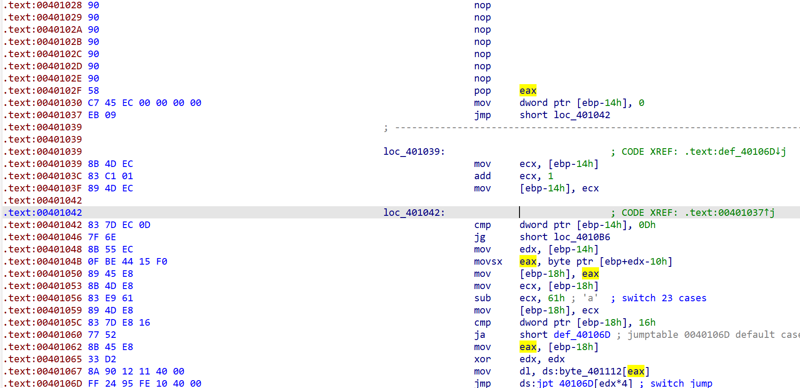

> 我们以本题来讲解一种典型的花指令处理方式

## 0x00 - UPX
发现UPX壳，使用`upx -d`脱壳即可。

## 0x01 - Direct Disassemble
使用IDA打开发现无法正常反编译：


先在`Options>General>Disassembly`中打开`Stack pointer`，将`Number of opcode bytes (non-graph)`改成`16`。


## 0x02 - Defuzz
以`0x401028`为例：
```asm
.text.00401028 33 C1           xor     eax, ecx
.text.0040102A 3B C1           cmp     eax, ecx
.text.0040102C 75 01           jnz     short near ptr loc_40102E+1
.text.0040102E E8 58 C7 45 EC  call    near ptr 0EC85D78Bh
```
前面三句可以翻译成大家比较熟悉的样子：
```c
eax ^= ecx;
if (eax != ecx)
	JMP(0x40102F);
```

而我们知道`EAX ^ ECX != ECX`在二者不均为0的时候是恒成立的，故该跳转总会进行，因此我们可以将`[0x401028-0x40102E]`这7个字节全部忽略，为了方便操作，我们选择直接`nop`掉。

切换到`Hex View`，按下`F2`开始编辑，将`[0x401028-0x40102E]`这7个字节全部改成`0x90`，即`x86`架构下的`nop`，再按下`F2`确认更改：


再回到`IDA View`发现这段已经可以正常反汇编了:


再在`0x401000`处按下`P`键创建函数即可正常反汇编。
```cpp
int __cdecl main(int argc, const char **argv, const char **envp)
{
  int i; // [esp+10h] [ebp-14h]
  char input[16]; // [esp+14h] [ebp-10h] BYREF

  printf("Go through the maze to get the flag!\n");
  scanf("%14s", input);
  for ( i = 0; i <= 13; ++i )
  {
    switch ( input[i] )
    {
      case 'a':
        --X;
        break;
      case 'd':
        ++X;
        break;
      case 's':
        --Y;
        break;
      case 'w':
        ++Y;
        break;
      default:
        continue;
    }
  }
  if ( X == 5 && Y == -4 )
  {
    printf("Congratulations!\n");
    printf("Here is the flag:flag{%s}\n", input);
  }
  else
  {
    printf("Try again...\n");
  }
  return 0;
}
```

## 0x03 - Analyse
`X`初始值为`7`，`Y`初始值为`0`。最后分别要变成`5`和`-4`。
反编译结果中没有给出迷宫的验证逻辑。我们按下`Shift + F12`打开字符串窗口，显然`0x408030`处是真正的迷宫。结合起始和终点坐标可以猜出是`7x10`的地图，走出即可。
```
*******+**
******* **
****    **
**   *****
** **F****
**    ****
**********
```

## 0x04 - Flag
`flag{ssaaasaassdddw}`
